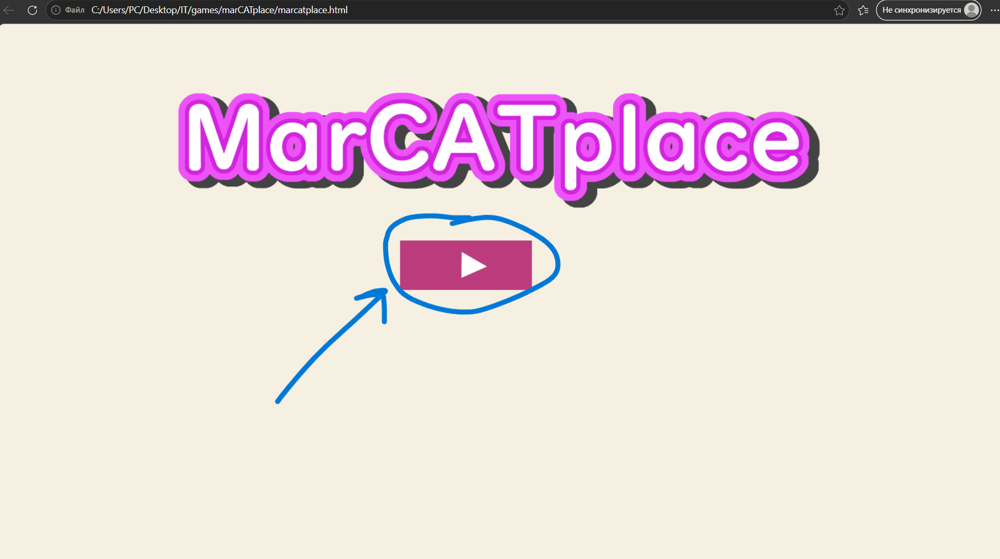
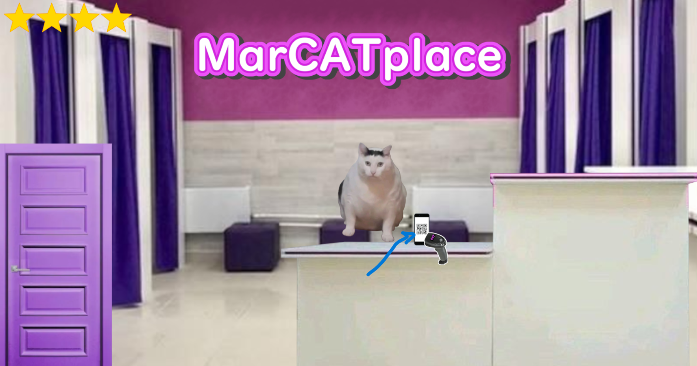
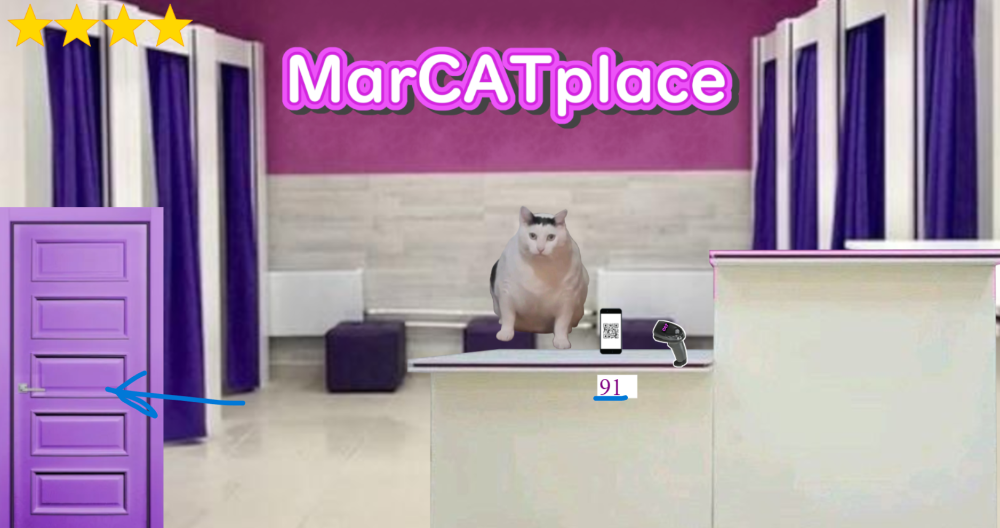
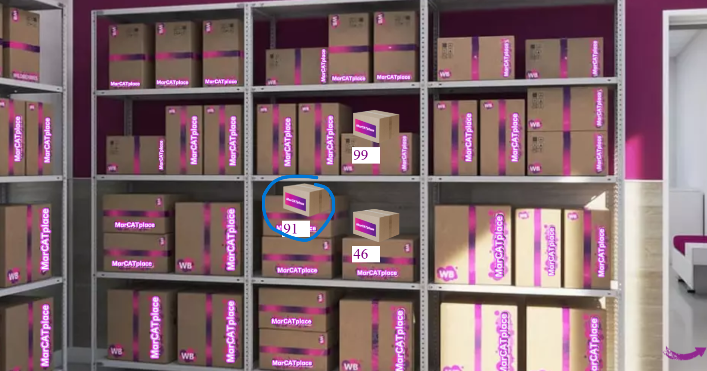
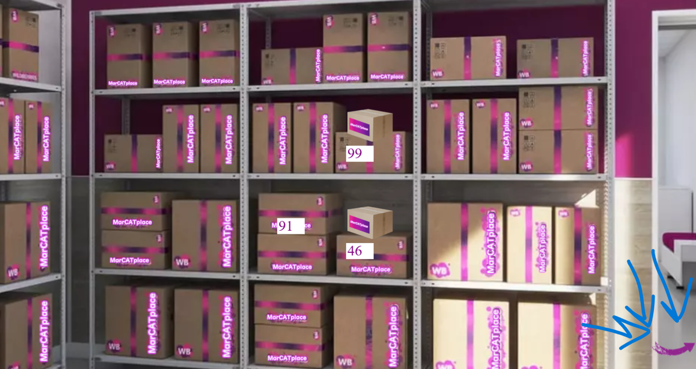
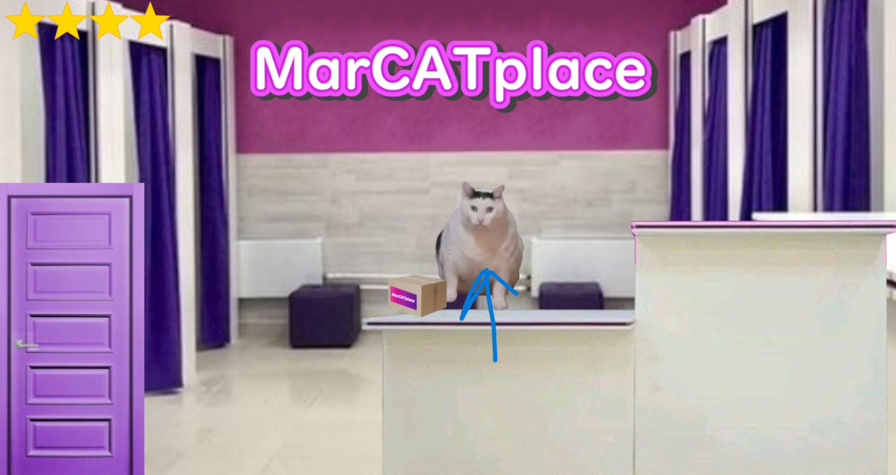

### JavaScript game 
---

# 
  marCATplace 

### Описание
Симулятор сотрудника ПВЗ с мемными котами   

Поскольку проект писала в очень сжатые сроки (2 дня) <u>с нулевыми знаниями</u> в JavaScript в игре присутствуют баги, ну и сама игра <b>НЕ</b> доведена до идеала  

### Как играть?

1. **Начало игры**  
   Нажмите на кнопку **Плей** в центре главного экрана.
   

2. **Встреча гостя**  
   К вам на стойку ПВЗ придет кот и покажет свой QR-код на экране телефона. Нажмите прямо на этот **QR-код**.
     

3. **Получение номера**  
   Запомните **число (номер посылки)**, которое отобразится на экране после сканирования.

4. **Переход на склад**  
   Перейдите в зону склада с коробками.
   

5. **Поиск посылки**  
   Найдите коробку с числом, которое вы только что запомнили, и **нажмите на неё**.
   

6. **Возвращение**  
   Вернитесь на пункт выдачи (ПВЗ), нажав на **маленькую стрелку** в правом нижнем углу экрана.
   

7. **Выдача заказа**  
   Нажмите на кота, чтобы **отдать посылку коту**.
   
  

### Планы по доработке проекта (Backlog)

1. **Интерфейс и визуальная часть (UX/UI)**
   - Адаптация и оптимизация интерфейса под различные разрешения экранов.
   - Реализация внутриигрового обучения (Onboarding) или улучшение UX для более интуитивного игрового процесса.
   - Добавление анимаций для игровых объектов.
   - Оптимизация отрисовки UI: перенос повторяющихся элементов (например, звезд рейтинга) на повторное использование (Reusability) вместо создания дублирующих объектов.
  
2. **Исправление известных багов**
   - Устранение логической ошибки при стартовой инициализации рейтинга (отображается 4 звезды вместо 5).
   - Исправление бага обновления состояния при смене персонажа (предыдущая посылка не исчезает при появлении нового кота).

3. **Развитие функционала (New Features)**
   - Расширение пула персонажей и настройка системы их случайного появления с разной долей вероятности.
   - Создание внутриигровой коллекции (галереи) встреченных котов.
   - Доработка и усложнение системы подсчета рейтинга игрока.

  
*Проект находится на стадии активной поддержки. Планирую развивать и оптимизировать его в свободное время.*
